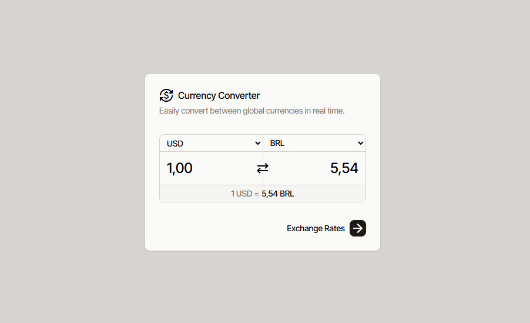

# 💱 Conversor de Moedas - JavaScript + Tailwind CSS

Este é um **Conversor de Moedas** feito com **JavaScript + Tailwind CSS**, com suporte a:

- ✅ Conversão entre múltiplas moedas usando a ExchangeRate API
- 📦 Cache em `localStorage` para evitar requisições desnecessárias
- 🔄 Inversão de moedas e valores com um clique
- 🌐 Deploy via GitHub Pages

 <!-- opcional, se quiser colocar uma imagem -->

---

## 🚀 Deploy

Acesse o projeto online:  
👉 [https://byruzie.github.io/currency-converter.js/](https://byruzie.github.io/currency-converter-js/)

---

## 🧰 Tecnologias usadas

- HTML5 + CSS3
- JavaScript (VanillaJS)
- jQuery + jQuery Mask
- ExchangeRate API
- localStorage para cache de dados da API

---

## 🧠 Aprendizados

- Trabalhar com dados externos (APIs): como consumir uma API, tratar erros e usar os dados dinamicamente na interface.
- Performance com cache local: salvar os dados no localStorage para reduzir chamadas repetitivas à API e otimizar o app.
- Manipulação de DOM com JavaScript: preencher `<select>`, capturar eventos de input e alteração, e atualizar dinamicamente os valores convertidos.
- Máscara de valor monetário: uso de jQuery Mask para aceitar somente números com ponto e vírgula no padrão brasileiro.
- Tratamento de datas em JS: criar lógica para validar se o cache está "atualizado" (válido para o mesmo dia).
- Conversão e formatação de valores: trabalhar com parseFloat, .replace(), .toFixed() e adaptação de vírgulas e pontos para exibir corretamente os valores.
- Modo de teste com dados mockados (sem consumir a API);